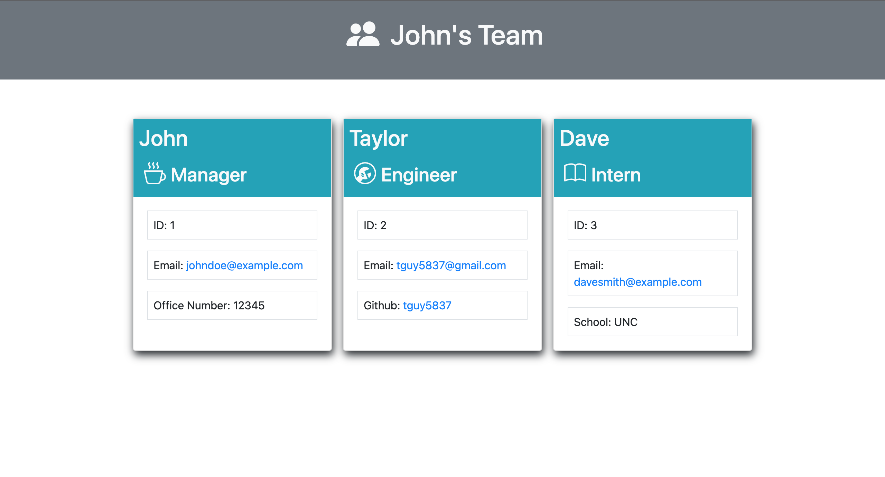

# Team Profile Generator

## Description

This team profile generator works by first prompting the user to add the manager's name, id, email, and office number. There can only be one manager on the team, the rest of the team members will be either Engineers or Interns.

Once the user has finished adding the managers info, they will be asked to add either an Engineer or an Inter. Once a choice has been made, prompts for the corresponding employee type will be displayed. The engineer will require name, id, email, and github username while the intern will require name, id, email, and their school.

This app was created to make team organization a breeze by dynamically creating HTML based on user input.

## Table of Contents

- [Installation](#installation)
- [Usage](#usage)
- [Questions](#questions)

## Installation

To use this application, make sure you are in the root directory in your command line and run 'npm i' to install all necessary dependencies to run the Team Profile Generator.

## Usage

To use this application, starting by running 'node index.js' while in the root directory to begin the initial prompts. If all packages were properly installed, the first prompt should be to input manager's info. Hit enter when to submit the current input and move on to the next prompt. When provided with a choices, like in the 'Add new employee' prompt, use the up and down arrow keys and the space bar to navigate and select/deselect different choices.

When You have added all desired employees, select the 'Finished' option in the 'Add new employee' prompt.

## Questions

### How to reach me:

GitHub: [tguy5837](https://github.com/tguy5837)

Email: [tguy5837@gmail.com](mailto:tguy5837@gmail.com)
